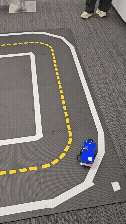

# duckietownRL

Duckietown lane-following training and evaluation on top of Duckiematrix.

This repository is now centered on:

- Duckiematrix standalone engine as the simulator backend
- Ray RLlib PPO as the only maintained training path
- 1D continuous `heading` actions
- ONNX export for deployment
- two observation modes:
  - `rgb`
  - `binary_lane`

The current recommended path is:

- `heading_clipped_08`
- `binary_lane`
- `84x84`
- `3` stacked frames
- RLlib PPO

## Demo



## Current Status

What is maintained:

- multi-engine RLlib training
- RLlib evaluation
- ONNX export
- binary lane observation pipeline

What is no longer the main path:

- SB3 training

`core/env_builder.py` is the real environment-builder module.

## Main Entry Points

- [test/train_multi_engine_rllib.py](/home/bcsi220/PycharmProjects/duckietownRL/test/train_multi_engine_rllib.py)
  - main training entry point
- [test/eval_rllib_model.py](/home/bcsi220/PycharmProjects/duckietownRL/test/eval_rllib_model.py)
  - evaluate one checkpoint
- [test/eval_rllib_checkpoints.py](/home/bcsi220/PycharmProjects/duckietownRL/test/eval_rllib_checkpoints.py)
  - batch-evaluate a checkpoint directory
- [test/export_rllib_heading_onnx.py](/home/bcsi220/PycharmProjects/duckietownRL/test/export_rllib_heading_onnx.py)
  - export one RLlib checkpoint to ONNX

## Observation Modes

Two modes are supported.

### `rgb`

Pipeline:

```text
crop -> resize(84x84) -> optional photometric/frame repeat/blur -> stack 3 frames
```

This is the older path.

### `binary_lane`

Pipeline:

```text
crop -> resize(84x84) -> optional photometric -> lane mask -> binary lane image -> optional mask noise -> stack 3 frames
```

`binary_lane` means:

- black background
- white lane pixels
- 3 identical channels per frame
- 3-frame stack at the network input

This is the current recommended training path.

## Action Space

The policy predicts a single scalar:

- `heading in [-1, 1]`

This is mapped to wheel commands by [action_wrappers.py](/home/bcsi220/PycharmProjects/duckietownRL/wrappers/action_wrappers.py).

Current recommended mappings:

- `heading_clipped_08`
- `heading`

Not recommended as the default path anymore:

- `heading_smooth`

## Environment Defaults

The common environment defaults are:

- crop top ratio: `0.33`
- resized observation: `84x84`
- frame stack: `3`
- `heading`
- `max_steer = 1.0`

Training script defaults are defined in:

- [env_builder.py](/home/bcsi220/PycharmProjects/duckietownRL/core/env_builder.py)
- [test/train_multi_engine_rllib.py](/home/bcsi220/PycharmProjects/duckietownRL/test/train_multi_engine_rllib.py)

## Respawn Behavior

The training scripts default to:

- `respawn_mode=random`
- `respawn_backend=engine`

In the current codebase, actual random reset behavior comes from the Duckiematrix engine, not from a project-side respawn implementation:

- [`DuckiematrixDB21JEnv.reset()`](/home/bcsi220/PycharmProjects/duckietownRL/core/duckiematrix_env.py:113) only sends `reset_flag` to the engine
- training/eval scripts pass the respawn settings to Duckiematrix through env vars
- [`respawn_wrapper.py`](/home/bcsi220/PycharmProjects/duckietownRL/wrappers/respawn_wrapper.py) can still validate/retry resets, but it is not the mechanism that generates random spawn poses in the current setup

This repository currently assumes a locally patched Duckiematrix image for engine-side random respawn behavior. In the current local setup, the project is using:

- `duckietown/dt-duckiematrix:ente-amd64`

The current training/eval scripts request a smaller yaw jitter setup than the earlier large-angle experiments.

Project-side defaults currently use:

- `yaw_jitter_deg = 8.0`
- `max_spawn_angle_deg = 8.0`

Important:

- these are the values the scripts request from the engine-side respawn implementation
- actual reset behavior depends on the patched Duckiematrix image in use
- the current repo does not provide a working project-side random respawn implementation independent of the engine
- if exact lane-relative spawn angle matters, validate it from live reset samples instead of assuming the env vars are enforced exactly

Relevant files:

- [core/duckiematrix_env.py](/home/bcsi220/PycharmProjects/duckietownRL/core/duckiematrix_env.py)
- [core/env_builder.py](/home/bcsi220/PycharmProjects/duckietownRL/core/env_builder.py)
- [test/train_multi_engine_rllib.py](/home/bcsi220/PycharmProjects/duckietownRL/test/train_multi_engine_rllib.py)
- [test/eval_rllib_model.py](/home/bcsi220/PycharmProjects/duckietownRL/test/eval_rllib_model.py)
- [test/eval_rllib_checkpoints.py](/home/bcsi220/PycharmProjects/duckietownRL/test/eval_rllib_checkpoints.py)
- [respawn_wrapper.py](/home/bcsi220/PycharmProjects/duckietownRL/wrappers/respawn_wrapper.py)

## Repository Layout

- [maps](/home/bcsi220/PycharmProjects/duckietownRL/maps)
  - training maps and common evaluation maps such as `curling`
- [observation_wrappers.py](/home/bcsi220/PycharmProjects/duckietownRL/wrappers/observation_wrappers.py)
  - crop/resize
  - photometric augmentation
  - motion blur
  - binary lane mask extraction
  - lane mask noise
- [action_wrappers.py](/home/bcsi220/PycharmProjects/duckietownRL/wrappers/action_wrappers.py)
  - heading-to-wheels mapping
- [reward_wrappers.py](/home/bcsi220/PycharmProjects/duckietownRL/wrappers/reward_wrappers.py)
  - lane-following reward
- [duckiematrix_env.py](/home/bcsi220/PycharmProjects/duckietownRL/core/duckiematrix_env.py)
  - Duckiematrix DB21J Gym wrapper
- [core](/home/bcsi220/PycharmProjects/duckietownRL/core)
  - environment construction, map utilities, lane utilities, frame stack
- [runtime](/home/bcsi220/PycharmProjects/duckietownRL/runtime)
  - standalone and engine control helpers
- [tools](/home/bcsi220/PycharmProjects/duckietownRL/tools)
  - plotting and developer utilities
- `runs_*`
  - training outputs, checkpoints, eval logs

## Recommended Training Commands

### Recommended binary lane training

```bash
python test/train_multi_engine_rllib.py \
  --maps _custom_technical_floor,_huge_V_floor,_plus_floor \
  --num-workers 5 \
  --forward-speed-min 0.5 \
  --forward-speed-max 0.8 \
  --motion-blur-kernel-size 3 \
  --observation-mode binary_lane \
  --lane-mask-noise-strength 0.3 \
  --heading-type heading_clipped_08
```

### Binary lane with light photometric

```bash
python test/train_multi_engine_rllib.py \
  --maps _custom_technical_floor,_huge_V_floor,_plus_floor \
  --num-workers 5 \
  --forward-speed-min 0.5 \
  --forward-speed-max 0.8 \
  --motion-blur-kernel-size 3 \
  --photometric-aug-strength 0.5 \
  --observation-mode binary_lane \
  --lane-mask-noise-strength 0.3 \
  --heading-type heading_clipped_08
```

### Resume training from a checkpoint

```bash
python test/train_multi_engine_rllib.py \
  --maps _custom_technical_floor,_huge_V_floor,_plus_floor \
  --num-workers 5 \
  --logdir runs_db21j_multi_engine_rllib \
  --save-name rllib_db21j_multi_engine \
  --load-checkpoint runs_db21j_multi_engine_rllib/checkpoints/rllib_db21j_multi_engine_655360 \
  --timesteps 1000000 \
  --forward-speed-min 0.5 \
  --forward-speed-max 0.8 \
  --motion-blur-kernel-size 3 \
  --observation-mode binary_lane \
  --lane-mask-noise-strength 0.3 \
  --heading-type heading_clipped_08
```

Notes:

- `--timesteps` means additional timesteps, not total timesteps
- `--photometric-aug-strength` matters less in `binary_lane` mode than in `rgb`
- `--yellow-lane-aug-strength` is part of the older RGB path and is not the main recommended setting now

## Evaluation Commands

### Evaluate one checkpoint

```bash
python test/eval_rllib_model.py \
  --checkpoint runs_db21j_multi_engine_rllib/checkpoints/rllib_db21j_multi_engine_655360 \
  --maps-dir ./maps \
  --map curling \
  --episodes 18 \
  --respawn-mode fixed \
  --forward-speed 0.5 \
  --motion-blur-kernel-size 3 \
  --observation-mode binary_lane \
  --heading-type heading_clipped_08
```

### Evaluate all checkpoints in one run directory

```bash
python test/eval_rllib_checkpoints.py \
  --checkpoints-dir runs_db21j_multi_engine_rllib/checkpoints \
  --maps-dir ./maps \
  --map curling \
  --episodes 18 \
  --respawn-mode fixed \
  --forward-speed 0.5 \
  --motion-blur-kernel-size 3 \
  --observation-mode binary_lane \
  --heading-type heading_clipped_08
```

## ONNX Export

Export one RLlib checkpoint:

```bash
python test/export_rllib_heading_onnx.py \
  --checkpoint runs_db21j_multi_engine_rllib/checkpoints/rllib_db21j_multi_engine_655360/policies/default_policy \
  --output runs_db21j_multi_engine_rllib/export/rllib_db21j_multi_engine_655360_heading.onnx \
  --forward-speed 0.5 \
  --heading-type heading_clipped_08
```

This writes:

- `*.onnx`
- `*.onnx.json`

The metadata records:

- input shape
- crop ratio
- frame stack
- heading type
- forward speed
- max steer

## Deployment

Training and export happen in this repository.

Real-robot deployment happens in:

- `lane_following`

The intended deployment loop is:

```text
camera -> crop -> resize -> binary lane image -> stack 3 frames -> ONNX -> heading_to_wheels -> motors
```

## Dependencies

This repository does not manage the full stack. It assumes you already have a working environment with at least:

- `ray[rllib]`
- `torch`
- `gymnasium`
- `opencv-python`
- `onnx`
- `onnxruntime`
- `duckietown-sdk`
- Duckiematrix / `dts matrix`

The main local environment used here is:

- `py311`

## Known Caveats

- `binary_lane` is workable on the real robot, but the lane mask usually needs to be adjusted for your own camera, lighting, and track conditions
- if deploy preprocessing changes, ONNX behavior changes even if the checkpoint stays the same
- random respawn currently depends on local Duckiematrix engine/image behavior; keep the image version and patch state explicit
- model selection should not rely on one sim score only; compare both sim rollouts and real failure replays
